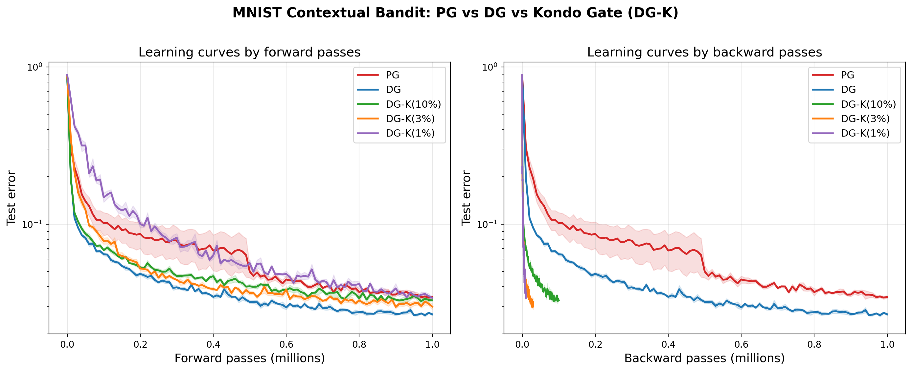

# Kondo Gate: MNIST Contextual Bandit Results

Reproduction of the MNIST experiment from [arXiv:2603.20526](https://arxiv.org/abs/2603.20526) using this PyTorch implementation.

## Setup

- **Task:** MNIST contextual bandit — image in, agent picks digit (0-9), reward 1 if correct, 0 otherwise
- **Architecture:** 2-layer ReLU MLP (784 -> 100 -> 100 -> 10)
- **Optimizer:** Adam, lr=1e-3
- **Batch size:** 100
- **Training:** 10,000 gradient steps, evaluated every 100 steps
- **Seeds:** 5
- **Baseline:** Expected confidence (b = sum pi(a)^2)
- **Device:** CPU

## Methods

| Method | Description | Backward passes per step |
|--------|-------------|--------------------------|
| **PG** | Standard REINFORCE | 100 (all) |
| **DG** | Delightful Gradient — sigmoid(delight) weighting | 100 (all) |
| **DG-K(10%)** | Kondo gate, top 10% by delight | ~10 |
| **DG-K(3%)** | Kondo gate, top 3% by delight | ~3 |
| **DG-K(1%)** | Kondo gate, top 1% by delight | ~1 |

## Results

### Summary Table

| Method | Final Error | Backward % | Total Backward Passes | Steps to 5% Error |
|--------|-------------|------------|----------------------|-------------------|
| PG | 3.44% +/- 0.13% | 100% | 1.00M | 5,000 |
| DG | 2.67% +/- 0.10% | 100% | 1.00M | 1,800 |
| DG-K(10%) | 3.28% +/- 0.08% | 10% | 0.10M | 2,600 |
| DG-K(3%) | 2.99% +/- 0.28% | 3% | 0.03M | 3,000 |
| DG-K(1%) | 3.40% +/- 0.10% | 1% | 0.01M | 5,100 |

### Learning Curves



**Left panel (by forward passes):** All methods take the same number of gradient steps. DG and DG-K converge much faster than PG. DG-K at 3% and 10% closely track full DG.

**Right panel (by backward passes):** This is the key result. When measured by actual backward compute:
- DG-K(3%) reaches 5% error using **0.03M backward passes** vs DG's 0.18M — a **6x speedup**
- DG-K(1%) reaches 5% error using **0.01M backward passes** — a **18x speedup** over DG
- All DG-K variants beat PG in both final quality and compute efficiency

### Key findings

1. **DG-K(3%) matches DG quality at 3% backward cost.** Final error 2.99% vs 2.67%, using 33x fewer backward passes. The useful gradient signal is concentrated in ~3 out of 100 samples per batch.

2. **Even DG-K(1%) outperforms PG.** With just 1 backward pass per 100 samples, DG-K(1%) achieves 3.40% error vs PG's 3.44% — while using 100x fewer backward passes.

3. **DG dominates PG in both speed and quality.** DG reaches 5% error in 1,800 steps vs PG's 5,000 — a 2.8x speedup in wall-clock gradient steps, with better final performance.

4. **Delight correctly identifies informative samples.** The gate consistently selects the samples that produce the most learning signal per backward pass, confirming the paper's theoretical analysis (Proposition 1).

## Reproducing

```bash
pip install kondo-gate torchvision matplotlib
python examples/mnist_full_run.py
```

Results saved to `results/mnist_results.csv` and `results/mnist_comparison.png`.
